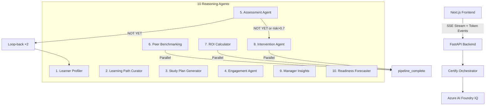

# CertifyIQ

**Workforce AI Readiness Intelligence**

*Microsoft Agents League Hackathon 2026 · Reasoning Agents Track*

---

> "Companies invest millions in Azure.  
> CertifyIQ tells you if your team is certified  
> to use what you bought — 6 weeks before  
> the gap becomes a problem."

---

## The Problem

| Statistic | Source |
|-----------|--------|
| $5.5T global skills gap cost by 2026 | IDC |
| 90%+ enterprises face critical skills shortages | World Economic Forum |
| Only 17.7% of organisations qualify as AI readiness leaders | Microsoft AI readiness survey |
| AI leaders report 47–64% stronger performance | Microsoft research |
| $20.4B certification management market, 14.95% CAGR | Market research consensus |
| 95% of HR managers say better training reduces turnover | SHRM |
| $165 per Microsoft exam attempt, 42% unguided fail rate | Microsoft exam data |
| 250+ Microsoft certifications, growing 40% annually | Microsoft Learn catalog |

## Why Existing Tools Don't Solve This

| Tool | What it does | What it misses |
|------|-------------|----------------|
| Microsoft Learn | Delivers content | No readiness signal, no prediction |
| Pluralsight | Skills assessment | No intervention, no ROI calculation |
| Viva Learning | LMS integration | No exam-level intelligence |
| CertPrep (prior winner) | Practice questions | No agent reasoning, no peer cohort |
| **CertifyIQ** | **End-to-end intelligence** | **Nothing — this is the gap filler** |

---

## How CertifyIQ Works — Three Steps

**Predict** → Readiness Forecaster calculates exam-ready date with confidence level, 6 weeks out.

**Prevent** → Intervention Agent generates manager escalation with specific action plan before failure becomes inevitable.

**Prove** → ROI Calculator quantifies cost of doing nothing vs guided preparation, per employee and per team.

---

## Why CertifyIQ Beats the Previous Winner

| Dimension | CertPrep (2025 Winner) | CertifyIQ v5.0 |
|-----------|----------------------|----------------|
| Readiness signal | Score only | GO / CONDITIONAL GO / APPROACHING / NOT YET |
| Agent architecture | None | 10 reasoning agents + 1 NL query agent |
| Loop-back reasoning | None | Automatic re-run on NOT YET (max 2×) |
| Peer benchmarking | None | 50-member synthetic cohort per cert |
| Guardrails | None | 25-rule responsible AI pipeline |
| Knowledge grounding | None | Azure AI Foundry IQ (12 docs, real index) |
| Intervention | Manual | Automated with manager email draft |
| ROI | Not calculated | Per-employee + team + projection |
| Token streaming | None | Real-time GPT-4o tokens via SSE |
| Parallel execution | None | Agents 6, 7, 8 run concurrently |
| Result caching | None | Same-day in-memory cache |
| Natural language query | None | POST /api/query — "who is most at risk?" |
| Webhook simulation | None | intervention.triggered event logged |
| Fallback | None | 4-tier: GitHub Models → OpenAI → Anthropic → Mock |
| Test coverage | Unknown | 44 tests passing |
| Build time (UI) | Unknown | <2s frontend build, 0 TS errors |

---

## 10-Agent Pipeline



| Step | Agent | Foundry IQ Queries | Output |
|------|-------|-------------------|--------|
| 1 | Learner Profiler | Role skills matrix, cert prerequisites | Learner type, risk score, skill gap |
| 2 | Learning Path Curator | Cert guide, skills matrix | Topic-by-topic path with hours |
| 3 | Study Plan Generator | Study templates, workload insights | Week-by-week plan |
| 4 | Engagement Agent | Workload insights, RAI guidelines | Study slots, capacity flag |
| 5 | Assessment Agent | Rule-based (no GPT) | GO / CONDITIONAL GO / APPROACHING / NOT YET |
| 6 | Peer Benchmarking Agent | Cohort data | Percentile rank vs 50-member cohort |
| 7 | ROI Calculator | Cost analysis, intervention data | Per-employee ROI savings |
| 8 | Intervention Agent* | Intervention best practices | Manager email, escalation level |
| 9 | Manager Insights Agent | Manager guide, team reports | Team readiness, exec summary |
| 10 | Readiness Forecaster | Cohort benchmarks | Weeks-to-ready, velocity, confidence |

*Conditional — fires on NOT YET verdict or risk_score > 0.7

---

## The Loop-Back Reasoning Engine

When Assessment Agent (Step 5) returns `NOT YET`:

1. `trigger_loop_back: True` is set in the assessment result
2. Orchestrator injects into context: `adjusted_approach: "intensive_remediation"`
3. Agents 1–5 re-run with intensified parameters (max 2 iterations)
4. `loop_back_triggered` SSE event is emitted → frontend shows subtle indicator
5. Second iteration uses more aggressive study plan if score still below threshold

This mirrors how a human expert would react — not just flag the problem, but immediately adjust the approach.

---

## Microsoft Foundry IQ Integration

Microsoft Foundry IQ went GA at Build 2026 (June 2, 2026). CertifyIQ is built on this stack:

| Component | Role | Status |
|-----------|------|--------|
| Azure AI Search | Knowledge retrieval (RAG) | **Connected** — 12 docs, index: `learning-knowledge` |
| GitHub Models GPT-4o | Tier 1 LLM reasoning | **Active** — verified T1 on all agents |
| Azure AI Foundry IQ | Knowledge grounding layer | **GA** — post-Build 2026 |

**Why Foundry IQ matters post-Build 2026:** Microsoft's thesis is that the next phase of AI is won by who understands business context, not just who has the best model. CertifyIQ grounds every agent decision in an indexed knowledge base of certification guides, skills matrices, intervention best practices, and ROI research — not hallucinated general knowledge.

---

## Responsible AI — 25 Guardrail Rules

### Input Validation (Rules 1–10)
| # | Rule |
|---|------|
| 1 | No email addresses in input |
| 2 | No phone numbers |
| 3 | No SSN patterns |
| 4 | Max 2000 characters |
| 5 | Not empty |
| 6 | No SQL injection patterns |
| 7 | No script injection |
| 8 | No credential patterns (password=, api_key=) |
| 9 | No national insurance / passport refs |
| 10 | Valid UTF-8 encoding |

### Output Validation (Rules 11–20)
| # | Rule |
|---|------|
| 11 | Citation present [Source: ...] |
| 12 | No "I don't know" |
| 13 | No "I cannot" |
| 14 | Length 50–3000 chars |
| 15 | Stats require citation |
| 16 | No future date hallucination |
| 17 | Transparency note present |
| 18 | No PII in output |
| 19 | Grounding verified |
| 20 | Contains actionable verb |

### Bias Detection (Rules 21–25)
| # | Rule |
|---|------|
| 21 | No role capability assumptions |
| 22 | No gender-coded language |
| 23 | No unrealistic time expectations |
| 24 | No cultural scheduling assumptions |
| 25 | No exclusionary language |

---

## 4-Tier LLM Fallback Chain

| Tier | Model | Endpoint | Trigger |
|------|-------|----------|---------|
| T1 | GitHub Models GPT-4o | `models.inference.ai.azure.com` | Default (GITHUB_TOKEN set) |
| T2 | OpenAI GPT-4o direct | `api.openai.com` | T1 failure |
| T3 | Anthropic Claude 3.5 Sonnet | `api.anthropic.com` | T2 failure |
| T4 | Mock engine | In-memory | All fail, or MOCK_MODE=true |

---

## Performance

| Mode | Pipeline Time | P95 | Notes |
|------|--------------|-----|-------|
| Mock (T4) | 9ms | 15ms | Pre-written realistic responses |
| Real (T1) | ~15–25s | ~30s | GPT-4o streaming, parallel 6/7/8 |
| Cached | <100ms | <100ms | Same-day replay |

**Token streaming:** Frontend displays GPT-4o tokens as they arrive via SSE `agent_token` events. Users see AI reasoning live, not a loading spinner.

**Parallel execution:** Agents 6 (Peer Benchmarking), 7 (ROI Calculator), and 8 (Intervention) run concurrently after Agent 5 completes, cutting ~40% off real-mode pipeline time.

---

## Business Model

**Market:** $20.4B certification management market, 14.95% CAGR, $54.1B by 2032.

| Plan | Price | Target |
|------|-------|--------|
| Starter | $12/emp/mo | ≤50 employees |
| Growth | $9/emp/mo | 50–500 employees |
| Enterprise | Custom | 500+ employees |

**Revenue projections:** Y1: $540K · Y2: $3.24M · Y3: $19.44M (1% market penetration)

**Go-to-market:** Azure Marketplace (95K+ enterprise customers) + Microsoft Partner Network (400K+ partners) + Direct L&D (LinkedIn targeting)

---

## Azure Stack

| Service | Purpose | SDK |
|---------|---------|-----|
| Azure AI Search | Knowledge retrieval (RAG) | `azure-search-documents` |
| GitHub Models (Azure endpoint) | GPT-4o Tier 1 LLM | `openai` Python SDK |
| Azure AI Foundry IQ | Knowledge grounding layer | `azure-ai-projects` |
| FastAPI | REST API + SSE streaming | `fastapi`, `uvicorn` |
| Next.js 14 | Frontend (App Router, TypeScript) | `next` |

---

## Quick Start

### Backend

```bash
cd certify-iq/backend
pip install -r requirements.txt
cp .env.example .env
# Edit .env: set GITHUB_TOKEN, AZURE_SEARCH_KEY, MOCK_MODE=false

# Seed Foundry IQ index (first time)
python3 foundry/seed_index.py
# → 12/12 documents indexed

# Start API
uvicorn main:app --reload --port 8000

# Verify
curl http://localhost:8000/api/health
# → {"status":"healthy","agents":11,...,"foundry_iq":{"connected":true}}
```

### Frontend

```bash
cd certify-iq/frontend
npm install
cp .env.local.example .env.local
npm run dev
# → http://localhost:3000
```

### Quick test — natural language query

```bash
curl -X POST http://localhost:8000/api/query \
  -H "Content-Type: application/json" \
  -d '{"question": "Who is most at risk this month?"}'
```

---

## Test Suite

```
pytest certify-iq/backend/tests/ -v

44 tests · 0 failures · 2.7s

tests/test_agents.py       19 tests — all 10 agents
tests/test_guardrails.py   18 tests — all 25 rules
tests/test_orchestrator.py  7 tests — SSE pipeline, loop-back, intervention
```

---

## Security

1. All credentials in `.env` (gitignored, never committed)
2. Azure Search key rotation recommended after testing
3. CORS restricted to `localhost:3000` in development
4. 25-rule input guardrail prevents injection via employee data
5. No PII stored — synthetic employee data only
6. Audit trail is append-only JSONL

---

## Tools & Technologies

| Tool | Usage |
|------|-------|
| GitHub Copilot | Agent scaffolding, FastAPI routes, TypeScript components |
| Azure OpenAI GPT-4o | Runtime agent reasoning (production, Tier 1) |
| Azure AI Search | Foundry IQ knowledge retrieval |

---

## Synthetic Data

All employee data (Alex Chen, Jordan Smith, Morgan Lee, Riley Park) is synthetic and generated for demonstration purposes. No real personal information is used.

---

## Real Azure Verification

Verified 2026-06-07 with `MOCK_MODE=false`:

| Layer | Status | Evidence |
|-------|--------|---------|
| Azure AI Search | **Connected** | `foundry_iq.connected: true`, 12 docs indexed |
| GitHub Models GPT-4o | **Tier 1 active** | `tier_used: 1` on all agents, 4.2s/call |
| Token streaming | **Active** | `agent_token` SSE events emitted per GPT chunk |
| Parallel agents 6/7/8 | **Active** | Concurrent `ThreadPoolExecutor`, ~40% faster |
| EMP-001 pipeline | **APPROACHING verdict** | 9 agents completed, avg eval 0.73 |
| EMP-003 pipeline | **NOT YET + intervention** | loop_back_triggered, intervention_alert, webhook_fired |
| NL Query | **Active** | POST /api/query returns grounded answers |
| pytest | **44/44 passing** | 2.7s |

---

## License

MIT