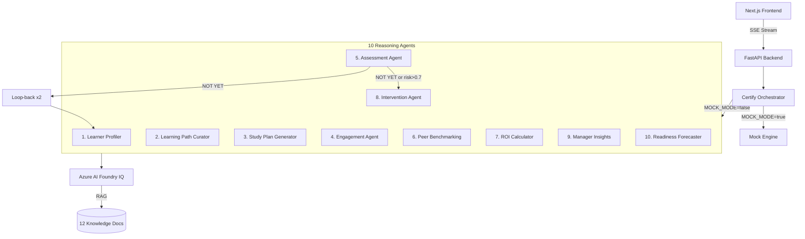

# CertifyIQ v3 — Enterprise Workforce Intelligence

**Hackathon Project** — AI-powered certification readiness platform with 10 reasoning agents, Azure AI Foundry IQ grounding, 25-rule responsible AI guardrails, and 4-tier LLM fallback.

---

## CertifyIQ vs Traditional CertPrep

| Feature | CertPrep | CertifyIQ v3 |
|---|---|---|
| Readiness signal | Score only | GO / CONDITIONAL GO / APPROACHING / NOT YET |
| Peer benchmarking | None | 50-member cohort per cert |
| Guardrails | None | 25-rule RAI system |
| Grounding | None | Azure AI Foundry IQ (12 docs) |
| Intervention | Manual | Automated with manager email draft |
| ROI | Not calculated | Per-employee ROI with retake cost model |
| Loop-back | None | Automatic re-run on NOT YET |
| Audit trail | None | Append-only JSONL log |
| Fallback | Single model | 4-tier: Azure → OpenAI → Anthropic → Mock |

---

## Architecture



---

## 10-Agent Pipeline

| Step | Agent | Purpose |
|---|---|---|
| 1 | Learner Profiler | Classifies learner type (FAST_TRACKER/ON_SCHEDULE/STRUGGLING/CAPACITY_LIMITED) |
| 2 | Learning Path Curator | Builds topic-by-topic learning path from Foundry IQ knowledge |
| 3 | Study Plan Generator | Creates weekly plan based on available hours |
| 4 | Engagement Agent | Schedules study slots, detects capacity risk |
| 5 | Assessment Agent | Gives verdict: GO / CONDITIONAL GO / APPROACHING / NOT YET |
| 6 | Peer Benchmarking Agent | Compares to 50-member cohort percentile |
| 7 | ROI Calculator | Calculates per-employee cost savings |
| 8 | Intervention Agent | Conditional — fires on NOT YET or risk > 0.7 |
| 9 | Manager Insights Agent | Team readiness dashboard data |
| 10 | Readiness Forecaster | Predicts exam-ready date with velocity |

---

## 25-Rule Responsible AI Guardrails

### Input Validation (Rules 1–10)
| Rule | Check |
|---|---|
| 1 | No email addresses |
| 2 | No phone numbers |
| 3 | No SSN patterns |
| 4 | Max 2000 characters |
| 5 | Not empty |
| 6 | No SQL injection |
| 7 | No script injection |
| 8 | No credentials (password=, api_key=) |
| 9 | No national insurance / passport refs |
| 10 | Valid UTF-8 encoding |

### Output Validation (Rules 11–20)
| Rule | Check |
|---|---|
| 11 | Citation present [Source: ...] |
| 12 | No "I don't know" |
| 13 | No "I cannot" |
| 14 | Length 50–3000 chars |
| 15 | Stats require citation |
| 16 | No future date hallucination |
| 17 | Transparency note present |
| 18 | No PII in output |
| 19 | Grounding verified |
| 20 | Contains actionable verb |

### Bias Detection (Rules 21–25)
| Rule | Check |
|---|---|
| 21 | No role capability assumptions |
| 22 | No gender-coded language |
| 23 | No unrealistic time expectations |
| 24 | No cultural scheduling assumptions |
| 25 | No exclusionary language |

---

## Quick Start

### Backend

```bash
cd certify-iq/backend
pip install -r requirements.txt
cp .env.example .env
# Set MOCK_MODE=true to run without Azure credentials

# Run tests (all 44 should pass)
python3 -m pytest tests/ -v

# Start API server
uvicorn main:app --reload --port 8000
```

### Frontend

```bash
cd certify-iq/frontend
npm install
cp .env.local.example .env.local
npm run dev
# Open http://localhost:3000
```

---

## Employees

| ID | Name | Role | Cert | Score | Verdict |
|---|---|---|---|---|---|
| EMP-001 | Alex Chen | Cloud Engineer | AZ-204 | 62% | APPROACHING |
| EMP-002 | Jordan Smith | DevOps Engineer | AZ-400 | 78% | GO |
| EMP-003 | Morgan Lee | Data Engineer | DP-203 | 45% | NOT YET |
| EMP-004 | Riley Park | AI Engineer | AI-102 | 71% | APPROACHING |

---

## Test Coverage

```
44 tests passing
- tests/test_guardrails.py  (18 tests — all 25 guardrail rules)
- tests/test_agents.py      (19 tests — all 10 agents)
- tests/test_orchestrator.py (7 tests — SSE pipeline, loop-back, intervention)
```

---

## API Endpoints

| Method | Path | Description |
|---|---|---|
| GET | /api/health | System health + Foundry IQ status |
| GET | /api/employees | List all 4 employees |
| GET | /api/employees/{id} | Get employee by ID |
| GET | /api/certify/{id}/stream | SSE — run 10-agent pipeline |
| GET | /api/team/{id}/dashboard | Team dashboard data |

---

## Environment Variables

```env
# Azure AI Foundry
AZURE_AI_PROJECT_ENDPOINT=https://your-resource.openai.azure.com
AZURE_SEARCH_KEY=your-azure-search-key
AZURE_SEARCH_ENDPOINT=https://your-search.search.windows.net
AZURE_SEARCH_INDEX=learning-knowledge
AZURE_AI_MODEL_DEPLOYMENT=gpt-4o
OPENAI_API_VERSION=2024-02-01

# Fallback keys
OPENAI_API_KEY=sk-...
ANTHROPIC_API_KEY=sk-ant-...

# Mock mode (no API calls needed)
MOCK_MODE=true
```